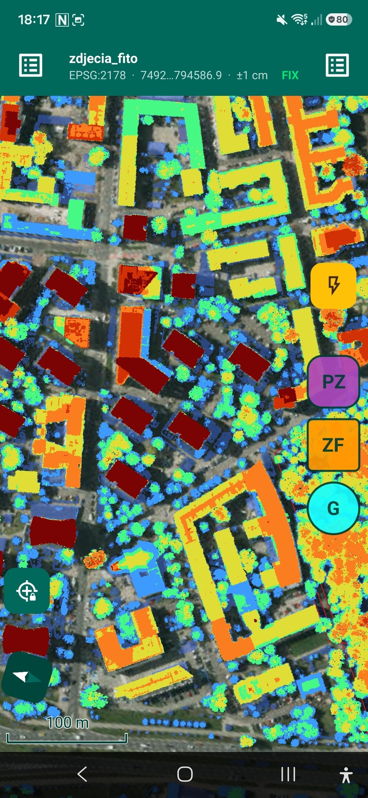

# WorkField

**A field-focused derivative of [QField](https://github.com/opengisch/QField),
tuned for vegetation inventory and surveying workflows in Poland.**

> ⚠️ **This is not QField.** WorkField is an independent fork and is **not
> created, endorsed, or supported by OPENGIS.ch or the QField project**.
> Looking for the official app? Get the **Official Packages** at
> [qfield.org](https://qfield.org/) — professionally maintained, widely
> tested, regularly updated. Full attribution and details: [NOTICE.md](NOTICE.md).

<p align="center">
  
</p>

## What is this?

WorkField currently adapts QField to one narrow job: 
**collecting vegetation inventory data in the field, in Poland, often one-handed and in gloves.** 
It is a personal, opinionated build — not a general-purpose replacement for QField.

Main differences from upstream:

- **Material 3 interface** — a Material Design 3 based theme with large
  touch targets for gloved outdoor use, and a GNSS status bar showing
  coordinates and quality class (FIX/FLOAT/GPS).
- **From Field to Room** — an ability to start, configure and work on a project directly in the field.
- **Camera** — shot presets (lens + zoom), continuous shooting series with no
  lost frames, Android orientation correction, flash and haptic feedback in
  fast capture mode, relative photo paths.
- **Capture workflow** — quick capture bar, fast mode taking positions
  directly from the GNSS source, series counter, project variables
  (`obiekt_*`), buffered raster value sampling.
- **Vector, Raster and XYX,WMS/WMTS data from worldwide and Polish national services (GUGiK) loadable, confugurable and often stylable in the field**.
- **Field DTM/DSM/CHM data download**
- **Branding** — distinct name, icon and splash to avoid confusion with
  official QField packages.

See [NOTICE.md](NOTICE.md) for the full statement and
[opengisch/QField](https://github.com/opengisch/QField) for the upstream
project this work builds on.

## Status

Experimental, developed for the author's own field work. There are **no
official releases, no prebuilt packages, and no support guarantees.** Things
may break between commits. If you need a dependable field GIS, use
[QField](https://qfield.org/).

Bug reports for WorkField are welcome **in this repository only** — please
never report issues from this fork to the QField project.

## Building

WorkField builds the same way as QField (see upstream
[developer documentation](https://github.com/opengisch/QField/blob/master/doc/dev.md)).
In short:

```bash
# Desktop (Linux)
cmake -S . -B build-sys -Wno-dev
cmake --build build-sys -j$(nproc)
./build-sys/output/bin/qfield

# Android (Docker, takes hours)
triplet=arm64-android ./scripts/build.sh
```

Branding assets live in [`brand/`](brand/); defaults for `APP_NAME`,
`APP_ICON` and `APP_THEME_PATH` are set in `CMakeLists.txt`.

## License

**GPL-2.0-or-later**, same as QField — see [LICENSE](LICENSE).
Original copyright © OPENGIS.ch and the QField contributors.
WorkField-specific changes © their respective authors, under the same license.

## Acknowledgements

WorkField exists thanks to the excellent open-source work of
[OPENGIS.ch](https://www.opengis.ch/), the QField community, and the
[QGIS](https://qgis.org/) project underneath it all. If QField helps you,
consider [supporting them](https://qfield.org/support-us/).

---

**Po polsku:** WorkField to niezależny fork QFielda pod terenową
inwentaryzację zieleni w Polsce (presety GUGiK, interfejs pod pracę w
rękawicach). To nie jest oficjalny QField — ten znajdziesz na
[qfield.org](https://qfield.org/). Szczegóły: [NOTICE.md](NOTICE.md).
